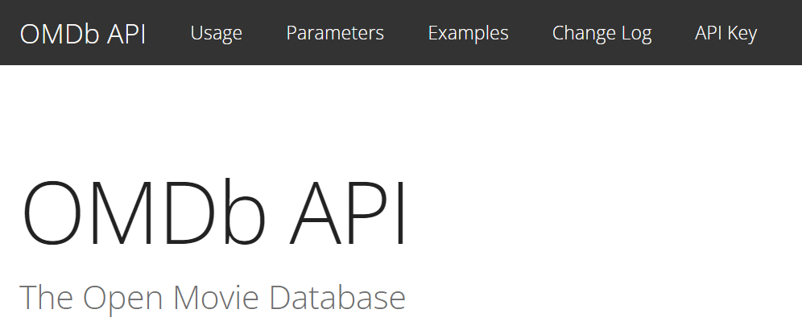

# Module 7 Interroger une API


## mise en place de fetch
```tsx
import { useState } from "react";
export default function App() {
    const [data,setData] = useState<any>({})
    const getData= async () => {
      const response =  await fetch ('https://swapi.dev/api/people/1');
      const data = await response.json();
      console.log(data);
      setData(data);
    }
   return (
    <>
    <button onClick={getData}>GET DATA</button>
    <br />{  data.name ?? <h2>{data.name}</h2>  } 
    </>
  )
}

```

## mise en place de axios

```
npm i axios
```
  
```tsx
import { useState } from "react";
import axios from 'axios';
export default function App() {
    const [data,setData] = useState<any>({})
    const getData= async () => {
      const response =  await axios.get('https://swapi.dev/api/people/1');
      setData(response.data);
    }
   return (
    <>
    <button onClick={getData}>GET DATA</button>
    <br />{  data.name ?? <h2>{data.name}</h2>  } 
    </>
  )
}
```
## OMDBAPI

  
https://www.omdbapi.com/
  
```tsx
import { useState } from "react";
import axios from 'axios';
export default function App() {
    const [data,setData] = useState<any>({})
    const getData= async () => {
      let key = 'xxx2275';
      let url =`http://www.omdbapi.com/?apikey=${key}&t=star`
      const response =  await axios.get(url);
      console.log(response.data);
      setData(response.data);
    }
   return (
    <>
    <button onClick={getData}>GET DATA</button>
    <br />{  data.Poster ?  :<p></p>  } 
    </>
  )
}
```


##  Ecriture dans le localStorage
```tsx
export default function App() {
   const ecriture =()=>{
    const fruits:any[] = ['pomme','poire','cerise'];
    // je serialise en string le tableau
    localStorage.setItem('fruits',JSON.stringify(fruits));
   } 
   return (
    <>
    <button onClick={ecriture}>Ecriture</button>  
    </>
  )
}
```

## Lecture dans le localStorage
```tsx
export default function App() {
   const lecture =()=>{
    const obj = localStorage.getItem('fruits');
    if (obj!= null){
      const tab:string[] = JSON.parse(obj);
      console.log( tab);
    }
   } 
   return (
    <>
    <button onClick={lecture}>Lecture</button>  
    </>
  )
}
```


## Effacer dans le localStorage
```tsx
export default function App() {
   const effacer =()=>{
    const obj = localStorage.getItem('fruits');
    if (obj!= null){
      localStorage.removeItem('fruits');
    }
   } 
   return (
    <>
    <button onClick={effacer}>Effacer</button>  
    </>
  )
}
```